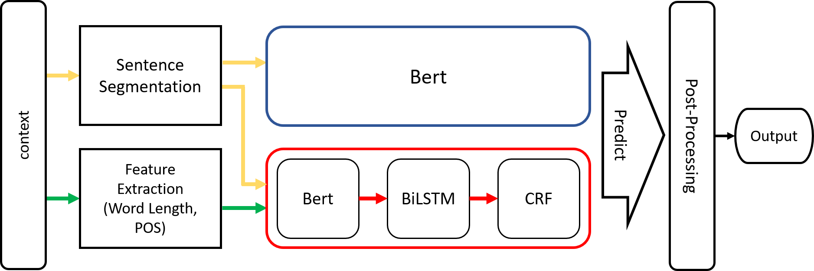

# NER-for-De-Identification
The NER task for De-Identification of PHI in the competition held by AICUP 2020.

We apply two different frameworks for this task:

1. BERT
    + Original BERT and with some ensemble methods

2. BBC (BERT+BiLSTM+CRF)
    + Combine BERT, BiLSTM and CRF

